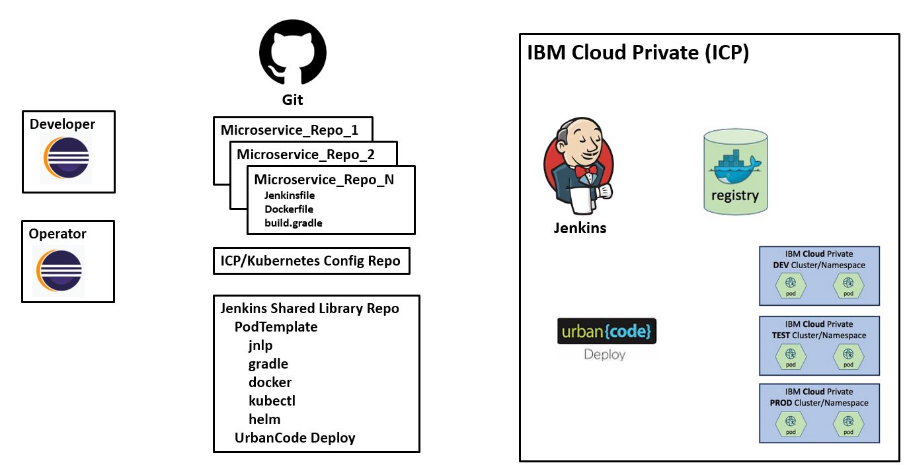
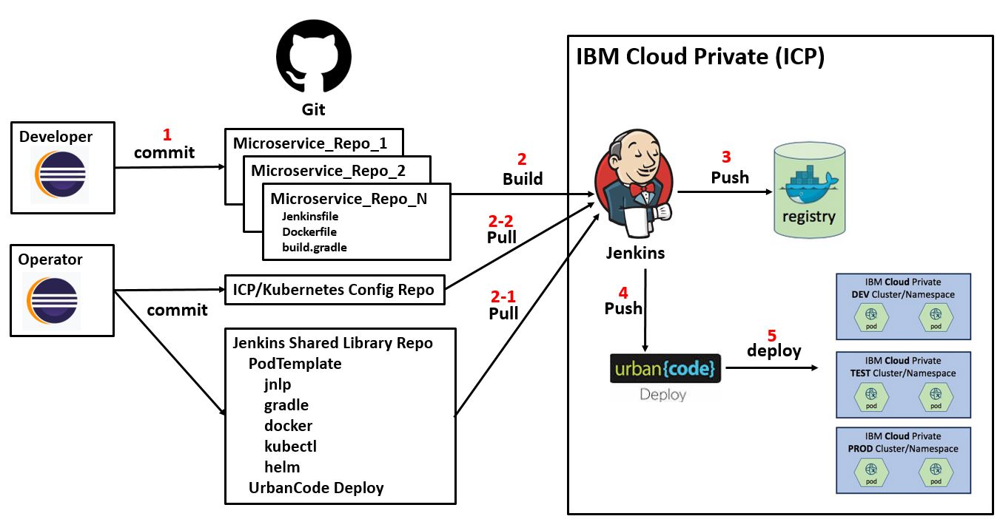
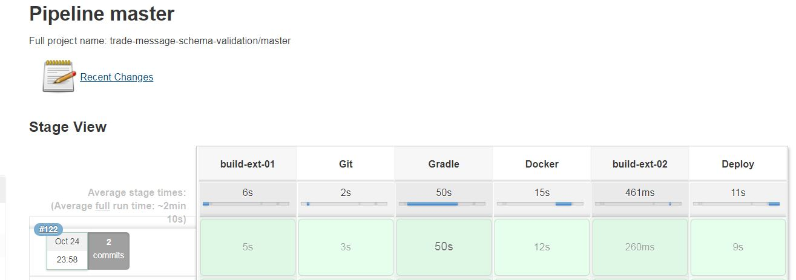

Jenkins Pipeline Design For Microservices Deployment in IBM Cloud Private
---
### Table of contents
[0. Background](#background)

[1. Architecture](#architecture)

[2. Pipeline_Flow](#pipeline_flow)

[3. Jenkins Pipeline_Flow Example](#pipeline_example)

[4. Summary](#summary)

## Background 

This document describes how to design a generic Jenkins pipeline to achieve continuous integration (CI) and continuous delivery (CD) for microservice architecture based solution deployment in IBM Cloud Private (ICP).

Microservice architecture based solution usually consists of many microservices that are stored in corresponding repositories in source code management system.
If the number of microservices projects per solution are tens or even hundreds, it will be very challenge to manage and maintain microservices deployment in ICP.

The following lists common challenges in regards with microservices deployment in ICP or any kubernetes environment.  

1. Each microservice has its own build instruction file.

2. Each microservice has its own deployment files or helm chart.

3. Each microservice may have its own environment specific properties settings.

Within the same solution design, most microservices share similar characteristics.  This implies it is likely all microservices can share same build and deployment infrastructure to avoid unnecessary duplicates.

To address these challenges, one approach is to build common build and deployment infrastructure to be used by all microservices. 
For example,

1. A common Jenkins pipeline shared by all microservices.

2. A deployment template that can support all microservices deployment.

3. A common application properties template that can be shared by all microservices.

4. UrbanCode Deploy can be used to control microservices deployment.

In this scenario Jenkins is used to build (compile) the application code and ship (create and push) a docker image to a docker registry. UrbanCode Deploy is then used to run (deploy) the image in one or more runtime environments.

## Architecture 
  

The diagram above shows the architecture for this Jenkins and UrbanCode Deploy CI/CD pipeline for microservices in IBM Cloud Private.

- Developer workstations host the applications required by the developer to create, edit and unit test their applications.

- Operator workstations host build and deployment related artifacts related to ICP/Kubernetes configuration files and Jenkins shared library files.

- Enterprise Git instance is the source code management (SCM) system and has the following repositories:
    - Microservices source code repositories: each microservice has its own repository.
    - ICP/Kubernetes configuration repository: all deployment and environment configuration related files are stored in this repository.
        - sample repo: https://github.com/ibmcheng1/tradebook-build-ext   
    - Jenkins Shared Library repository: this repository represent a podTemplate-based Jenkins pipeline shared by all microservices.
        - sample repo: https://github.com/ibmcheng1/build-lib

- Jenkins and the UrbanCode Deploy Server are deployed as Helm Charts in IBM Cloud Private. They may be deployed in a dedicated IBM Cloud Private Cluster or a dedicated namespace in a shared cluster

- Jenkins is configured to use shared library based on the Jenkins Shared Library repository.

- A Docker Registry stores the docker images. In this example, the Docker Registry that is part of IBM Cloud Private is used

- There are multiple runtime IBM Cloud Private environments. They may be namespaces in a single cluster or dedicated clusters.

## Pipeline Flow 

  

The diagram above shows the typical flow for this Jenkins and UrbanCode Deploy CI/CD pipeline for microservices in IBM Cloud Private.

1. A developer completes their code creation/changes and commits their code for a microservice repo to Git. The application repository contains the application source code plus:
    - Build Scripts: for example the build.gradle file
    - Jenkinsfile: the Jenkins pipeline configuration that uses configured shared library based on the Jenkins Shared Library repository.  It will set required parameters for the shared pipeline.  

2. A Jenkins build job is fired via a WebHook when the commit is completed
    - 2.1 Jenkins pulls Jenkins Shared Library repository to construct pipeline
    - 2.2 Jenkins also pulls CP/Kubernetes configuration repository to create deployment helm package for the current microservice.

3. Jenkins uses the Kubernetes plugin to dynamically create a Kubernetes Pod to perform the job steps. The job compiles and unit tests the application source code and then builds and pushes a Docker Image to the Docker Registry

4. Jenkins uses the UrbanCode Deploy plugin to push the Helm Chart files and information about the desired deployment to the target environment configured in UrbanCode Deploy Server

5. The UrbanCode Deploy Server invokes the UrbanCode Deploy Agent to deploy microservice to configured ICP namespace.

Note, operator commits changes to both ICP/Kubernetes configuration repository and Jenkins Shared Library repository will not trigger build.  However, whenever any change to these two repository, all microservices may need to re-build.

## Jenkins Pipeline Example 
  
  
  
## Summary 
This guide has described how to design a Jenkins pipeline shared by microservices to effectively manage microservices architecture based solution build and deployment in IBM Cloud Private.

